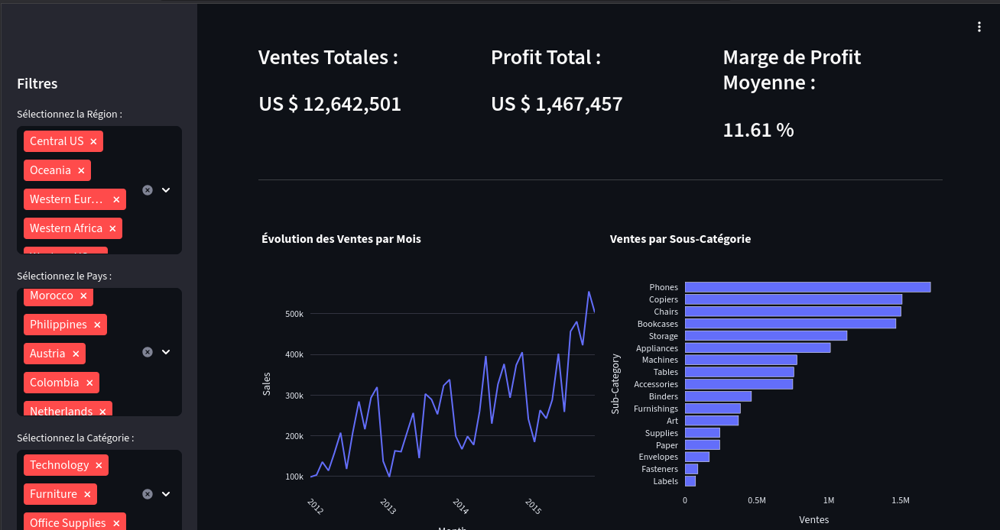

# Dashboard Interactif de Performance des Ventes

## 1. Vue d'ensemble

Ce projet est une application web interactive construite avec **Python et Streamlit** pour visualiser et analyser les données de ventes d'un supermarché mondial fictif. Le dashboard permet aux utilisateurs d'explorer les données de manière dynamique grâce à des filtres interactifs, démontrant ma capacité à transformer des données brutes en un outil de décisionnel intuitif.

**Lien vers l'application en ligne : [Apr_s Le déploiement]**

  

## 2. Objectifs du Projet

*   **Démontrer la maîtrise de Streamlit** pour la construction d'applications de données.
*   **Implémenter des filtres interactifs** pour permettre une exploration dynamique des données.
*   **Utiliser Plotly Express** pour créer des visualisations de données esthétiques et informatives.
*   **Structurer une application multi-composants** (KPIs, graphiques, tableaux de données).
*   **Préparer et déployer** une application Python dans un environnement cloud (Streamlit Community Cloud).

## 3. Caractéristiques (Features)

*   **Dashboard Principal :** Affiche les Indicateurs Clés de Performance (KPIs) comme les Ventes Totales, le Profit Total et la Marge de Profit.
*   **Filtres Interactifs :** L'utilisateur peut filtrer les données par :
    *   Région
    *   Pays
    *   Catégorie de produit
*   **Visualisations Dynamiques :** Tous les graphiques et KPIs se mettent à jour instantanément en fonction des filtres sélectionnés.
    *   **Graphique en Ligne :** Montre l'évolution des ventes par mois.
    *   **Graphique à Barres :** Compare la performance des ventes par sous-catégorie de produit.
*   **Vue Détaillée :** Un expander permet d'afficher le tableau de données brutes filtrées pour une analyse plus approfondie.

## 4. Outils et Librairies

*   **Langage :** Python
*   **Application Web :** Streamlit
*   **Manipulation de Données :** Pandas
*   **Visualisation :** Plotly Express
*   **Lecture de Fichiers Excel :** openpyxl

## 5. Comment Lancer le Projet Localement

1.  Clonez le repository :
    ```bash
    git clone https://github.com/manfoya/interactive-sales-dashboard.git
    cd interactive-sales-dashboard
    ```
2.  (Recommandé) Créez un environnement virtuel et activez-le :
    ```bash
    python -m venv venv
    source venv/bin/activate  # Sur Windows: venv\Scripts\activate
    ```
3.  Installez les dépendances :
    ```bash
    pip install -r requirements.txt
    ```
4.  Lancez l'application Streamlit :
    ```bash
    streamlit run app.py
    ```

## 6. Auteur

*   **TCHOKPON M. MARTIAL**
*   **Profil LinkedIn :** [LinkedIn](https://www.linkedin.com/in/martial-tchokpon/)